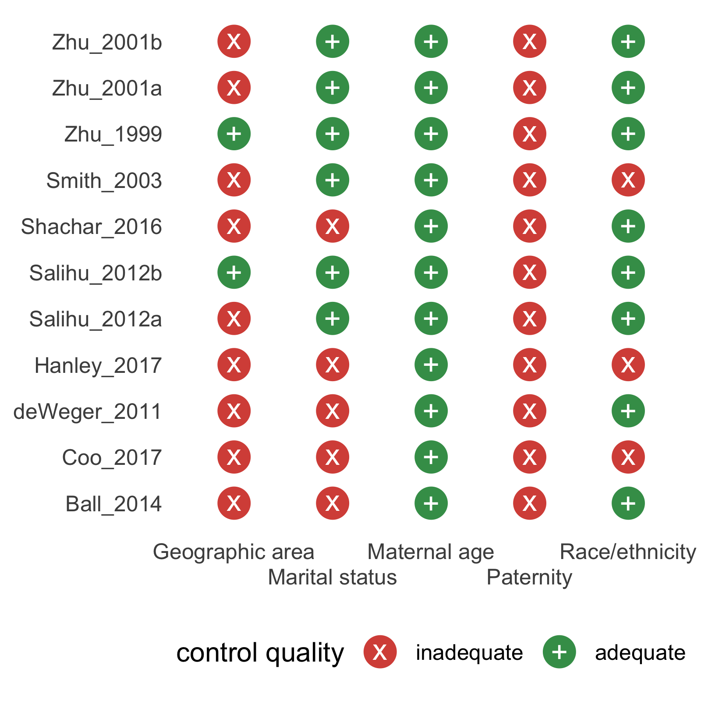

<!-- README.md is generated from README.Rmd. Please edit that file -->

# metaconfoundr

<!-- badges: start -->

[](https://lifecycle.r-lib.org/articles/stages.html)
[](https://CRAN.R-project.org/package=metaconfoundr)
[](https://github.com/malcolmbarrett/metaconfoundr/actions)
[](https://github.com/malcolmbarrett/metaconfoundr/actions)
[](https://app.codecov.io/gh/malcolmbarrett/metaconfoundr?branch=mainer)
<!-- badges: end -->

The goal of metaconfoundr is to make it easy to visualize confounding
control in meta-analyses. Researchers use a causal diagram to assess
factors that are required to control for to estimate an effect unbiased
by confounding. Then, the researchers create a data frame of confounding
variables and how well each study in the meta-analysis controlled for
each: adequately, inadequately, or with some control. See the vignette
on collecting confounder data for more information.

In addition to the package, metaconfoundr ships with a Shiny app to help
create visualizations. You can start the app locally with
`launch_metaconfoundr_app()` or [use the hosted
version](https://malcolmbarrett.shinyapps.io/metaconfoundr/).

## Installation

Install the most recent released version of metaconfoundr from CRAN:

``` r
install.packages("metaconfoundr")
```

You can install the development version of metaconfoundr from GitHub
with:

``` r
# if needed
# install.packages("remotes")
remotes::install_github("malcolmbarrett/metaconfoundr")
```

## Visualizing confounding control

metaconfoundr includes an example dataset, `ipi`, that contains
information on a meta-analysis of interpregnancy interval and the risk
of preterm birth. Use `metaconfoundr()` to prepare the dataset to work
with metaconfoundr functions. `ipi` includes several domains of
confounders, but for ease of visualization, we will just show one,
`Sociodemographics`.

``` r
library(metaconfoundr)
mc_ipi <- metaconfoundr(ipi) %>% 
  dplyr::filter(construct == "Sociodemographics")

mc_ipi
#> # A tibble: 55 × 5
#>    construct         variable     is_confounder study        control_quality
#>    <chr>             <chr>        <chr>         <chr>        <ord>          
#>  1 Sociodemographics Maternal age Y             Zhu_2001a    adequate       
#>  2 Sociodemographics Maternal age Y             Zhu_2001b    adequate       
#>  3 Sociodemographics Maternal age Y             Zhu_1999     adequate       
#>  4 Sociodemographics Maternal age Y             Smith_2003   adequate       
#>  5 Sociodemographics Maternal age Y             Shachar_2016 adequate       
#>  6 Sociodemographics Maternal age Y             Salihu_2012a adequate       
#>  7 Sociodemographics Maternal age Y             Salihu_2012b adequate       
#>  8 Sociodemographics Maternal age Y             Hanley_2017  adequate       
#>  9 Sociodemographics Maternal age Y             deWeger_2011 adequate       
#> 10 Sociodemographics Maternal age Y             Coo_2017     adequate       
#> # … with 45 more rows
```

metaconfoundr includes several tools for visualizing the results of a
confounding control assesment. The most common are `mc_heatmap()` and
`mc_trafficlight()`.

``` r
mc_heatmap(mc_ipi)
```


``` r
mc_trafficlight(mc_ipi)
```


These plotting functions return ggplots, so they are easy to modify.

``` r
mc_heatmap(mc_ipi) +
  theme_mc() +
  ggplot2::guides(x = ggplot2::guide_axis(n.dodge = 2))
```


metaconfoundr also includes geoms and scales to make output similar to
other types of bias assessments for meta-analyses.

``` r
mc_trafficlight(mc_ipi) +
  theme_mc() +
  geom_cochrane() + 
  scale_fill_cochrane()  +
  ggplot2::guides(x = ggplot2::guide_axis(n.dodge = 2))
```



# Similar work

For working with common assessments of bias in studies, such as the
ROBINS tool, see the excellent
[robvis](https://github.com/mcguinlu/robvis) package.

# Code of Conduct

Please note that the metaconfoundr project is released with a
[Contributor Code of
Conduct](https://raw.githubusercontent.com/malcolmbarrett/metaconfoundr/main/.github/CODE_OF_CONDUCT.md).
By contributing to this project, you agree to abide by its terms.
